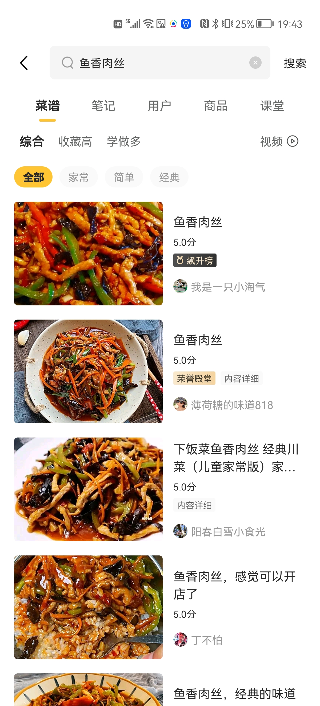

# 项目设计文档

## 懒人食谱

### 项目背景描述

> 懒人食谱是一款超级好用的美食菜谱软件，优质的图文菜谱解析，里面有超级齐全的菜谱，用户可以随时的查看后来制作美食，里面有详细的制作方法，手把手教你制作出美味，让用户能快速上手体验！

### 模块一：首页

 

#### 业务描述

- 轮播：系统每天抽取数据库==昨天==浏览量最高的前==三==道菜品
- 主题：放置==五==个后端管理员**置顶**的分类主题
- 一日四餐：展示==早餐==、==午餐==、==晚餐==、==夜宵==各个时间段的菜品

#### 前置条件

无     

### 模块二： 分类

 

#### 业务描述

给每道菜做详细的分类，比如==鸡肉韩式拌饭==，属于什么**菜式**、什么**功效**、什么**口味**、适合什么**人群**、对什么**疾病**有益、属于**水产**还是**蔬菜**、等等......

用户点击==分类==可以看到各种分类，选择分类后进入分类对应的==子分类==

#### 前置条件

无

#### 流程图

#### 表设计

##### 分类表：T_CATEGORY

| CATEGORY_ID | CATEGORY_NAME |  LEVEL   | PID        | TAG     | TOPPED             | CREATE_TIME | LAST_UPDATE_TIME | CREATOR | LAST_REVISER |
| :---------: | :-----------: | :------: | ---------- | ------- | ------------------ | :---------: | :--------------: | ------- | ------------ |
|  自增主键   |   分类名称    | 分类等级 | 父分类的ID | 标签    | 是否置顶到首页主题 |  创建时间   |   最后修改时间   | 创建人  | 最后修改人   |
|   bigint    |    varchar    | tinyint  | tinyint    | varchar | char(1)            |  datetime   |     datetime     | bigint  | bigint       |

> 字段备注：
>
> 1. `LEVEL` 分类级别，比如==菜式==的LEVEL为1，==菜式==里面的**菜肴/主食/西点**的LEVEL为2
> 2. `PID`分类有多级，采用设计可以关联到上下级分类
> 3. `TAG`是分类的标签名称，用于首页的==主题==显示，比如**热门菜谱#本周流行#**
> 4. `TOPPED`是否置顶到首页，用于首页的 ==主题==显示，同时置顶的分类最多只能有==五==项

##### 食谱表：T_COOKBOOK
| COOKBOOK_ID | COOKBOOK_TITLE | DESCRIBE | MATERIAL | MEALS    | LIKE_COUNT | COLLECT_COUNT | CREATE_TIME | LAST_UPDATE_TIME | CREATOR | LAST_REVISER |
| ----------- | -------------- | -------- | -------- | -------- | ---------- | ------------- | ----------- | ---------------- | ------- | ------------ |
| 自增主键    | 食谱标题       | 描述     | 材料     | 所属三餐 | 点赞量     | 收藏量        | 创建时间    | 最后修改时间     | 创建人  | 最后修改人   |
| bigint      | varchar        | varchar  | varchar  | char(1)  | bigint     | biging        | datetime    | datetime         | bigint  | bigint       |

> 字段备注：
>
> 1. `DESCRIBE` 食谱标题下方的描述,有的食谱没有,就为空
> 2. `MATERIAL` 食谱的**需要材料**
> 4. `MEALS` 首页的分类**早餐**、**午餐**、**晚餐**、**夜宵**

##### 食谱分类表：T_COOKBOOK_CATEGORY

| ID       | COOKBOOK_ID | CATEGORY_ID |
| -------- | ----------- | ----------- |
| 自增主键 | 食谱ID      | 分类ID      |
| bigint   | bigint      | bigint      |

> 备注：一道食谱可能属于多个**分类**,一个**分类**同时也包含多个食谱

##### 步骤表：T_COOKBOOK_STEP

| STEP_ID  | COOKBOOK_ID | STEP_CONTENT |  STEP_IMAGE  | STEP_ORDER     |
| :------: | :---------: | :----------: | :----------: | -------------- |
| 自增主键 |  所属食谱   |   步骤描述   | 步骤图片路径 | 步骤，第几步骤 |
|  bigint  |   bigint    |   varchar    |   varchar    | bigint         |

> 一个步骤就是一条记录，一条记录有当前步骤的描述，和当前步骤的图片
>
> STEP_ORDER存储1，2，3....，代表当前记录是第几步骤

### 模块三：分类二级

 

#### 业务描述

用户点击具体分类后进入该模块（**上图就是点击鱼香肉丝后显示的画面**），界面展示该分类和同级分类列表，并提供==最新==、==最热==、==最优==选项

1. ==最新== 查询该分类下的所有食谱，按添加时间降序显示
2. ==最热== 查询该分类下的所有食谱，按**收藏量**降序显示
3. ==最优== 查询该分类下的所有食谱，按**点赞量**降序显示

#### 前置条件

进入分类

### 模块四：管理员后台系统-食谱分类管理

#### 业务描述

管理app上所有的分类数据,在后端管理员可以**CRUD**分类数据,可以**置顶**分类

#### 前置条件

需要登录后台管理系统

### 模块五：管理员后台系统-食谱管理

#### 业务描述

管理app上所有的食谱数据,在后端管理员可以**CRUD**食谱数据,并设置食谱的分类和所属三餐

#### 前置条件

需要登录后台管理系统

