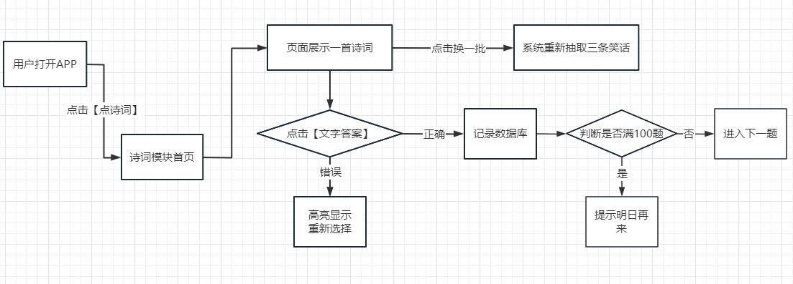
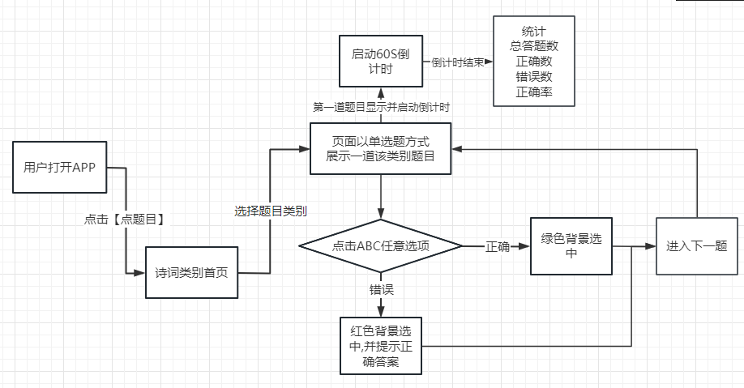

# 项目设计文档

## 知是荔枝

### 项目背景描述

> 欢喜点点app是一款集诗词、科学、历史等内容为一体的学习软件，通过线上进行试题内容的解答，来检测个人当前的知识储备，也能通过答题来学习增长个人对于各种类型知识内容的掌握，同时在进行答题过程中会拥有对应的时间限制，需要你在规定的时间范围内完成答题，以此来防止超时作答；欢喜点点最新版内还有各种趣味笑话内容提供给你进行阅读，针对好笑的内容可以在线进行文本复制，让你发送给你的朋友，让对方也能阅读笑话，以此来释放个人的压力，让你变得更加的开心。

### 模块一：点笑话

  

#### 业务描述

系统后台每天使用爬虫爬取（或者后台管理员添加）最新笑话，存储到数据库，前端`app`每次随机抽取==三条==之前未看过的笑话,并更新笑话到模块首页，用户可以点击==好笑==,==不好笑==给笑话设置权重,==好笑==的笑话会缓存到`redis`，且会优先推送给到用户。用户也可以复制出来转发给他的好友。

#### 前置条件

需要登录，并获得会员权限

#### 流程图

#### 表设计

##### 笑话表：T_JOKE

| joke_id  |  weight  | content  |  source  | create_time | last_update_time | creator | last_reviser |
| :------: | :------: | :------: | :------: | :---------: | :--------------: | ------- | ------------ |
| 自增主键 | 笑话权重 | 笑话内容 | 笑话来源 |  创建时间   |   最后修改时间   | 创建人  | 最后修改人   |
|  bigint  |   int    | varchar  | tinyint  |  datetime   |     datetime     | bigint  | bigint       |

##### 用户关联表：T_USER_JOKE

| user_joke_id | user_id | joke_id |
| ------------ | ------- | ------- |
| 自增主键     | 用户id  | 笑话id  |
| bigint       | bigint  | bigint  |

> 备注：用户和笑话是多对多关系，即一个用户看过多个笑话，一个笑话被多个用户看过

### 模块二 点诗词

  

#### 业务描述

系统后台每天使用爬虫爬取（或者后台管理员添加）诗词，存储到数据库，前端`app`每次随机抽取==一首==之前未完成的诗词，系统会摘取诗词的一二句或三四句，并截取掉每句诗词的第二字和第四字给到用户选择填空，同时系统会抽取整首诗词中的==6==个字加上截取掉的==4==个字，打乱后给到用户选择。用户如果选择错误，会高亮显示提示用户重新选择，全部选择正确后，进入下一首诗词选择。当天如果做满100题，系统提示明日再来。

#### 前置条件

需要登录，并获得会员权限

#### 流程图

 

#### 表设计

#### 表设计

##### 诗词表：T_POETRY

| poetry_id | content  |  source  | create_time | last_update_time | creator | last_reviser |
| :-------: | :------: | :------: | :---------: | :--------------: | ------- | ------------ |
| 自增主键  | 诗词内容 | 诗词来源 |  创建时间   |   最后修改时间   | 创建人  | 最后修改人   |
|  bigint   | varchar  | tinyint  |  datetime   |     datetime     | bigint  | bigint       |

##### 用户关联表：T_USER_POETRY

| user_poetry_id | user_id | poetry_id |
| -------------- | ------- | --------- |
| 自增主键       | 用户id  | 诗词id    |
| bigint         | bigint  | bigint    |

> 备注：用户和诗词是多对多关系，即一个用户看过多首诗词，一首诗词被多个用户看过

### 模块三：点题目

 

 

#### 业务描述

系统显示题目类别，比如`体育运动`,`地理旅行`,`历史快答`,`科学常识`,`音乐艺术`等等,后台可以动态添加.当用户选择某项类别后,进入答题界面,系统随机抽取200道题目后以单选题方式进行,用户选择答案后系统提示正确或错误并显示正确答案,然后进入下一题.每次答题系统会显示==60S==倒计时,倒计时结束后,统计总答题数,正确数,错误数和正确率.

#### 前置条件

需要登录，并获得会员权限

#### 流程图

  

#### 表设计

##### 题目类别表：T_SUBJECT

| subject_id | subject_name | create_time | last_update_time | creator | last_reviser |
| :--------: | :----------: | :---------: | :--------------: | ------- | ------------ |
|  自增主键  | 题目类别名称 |  创建时间   |   最后修改时间   | 创建人  | 最后修改人   |
|   bigint   |   varchar    |  datetime   |     datetime     | bigint  | bigint       |

##### 题目表：T_QUESTION

| question_id | content  | subject_id   | create_time | last_update_time | creator | last_reviser |
| :---------: | :------: | ------------ | :---------: | :--------------: | ------- | ------------ |
|  自增主键   | 题目内容 | 题目所属类别 |  创建时间   |   最后修改时间   | 创建人  | 最后修改人   |
|   bigint    | varchar  | bigint       |  datetime   |     datetime     | bigint  | bigint       |

##### 题目选项表：T_QUESTION_OPTION

| question_option_id | question_id | option_content | is_correct          |
| ------------------ | ----------- | -------------- | ------------------- |
| 自增主键           | 题目ID      | 选项内容       | 是否为正确答案(1,0) |
| bigint             | bigint      | varchar        | char                |

> 备注：题目表和题目类型表为多对一, 另外题目选项考虑到扩展性,所以分离出题目选项表,可以自由扩展伸缩选项的数量

### 模块四：管理员后台系统-笑话管理

#### 业务描述

管理app上所有的笑话数据,在后端管理员可以**CRUD**笑话数据

#### 前置条件

需要登录后台管理系统

### 模块五：管理员后台系统-诗词管理

#### 业务描述

管理app上所有的诗词数据,在后端管理员可以**CRUD**诗词数据

#### 前置条件

需要登录后台管理系统

### 模块六：管理员后台系统-题库管理

#### 业务描述

管理app上所有的题库数据,在后端管理员可以**CRUD**题库数据

#### 前置条件

需要登录后台管理系统
