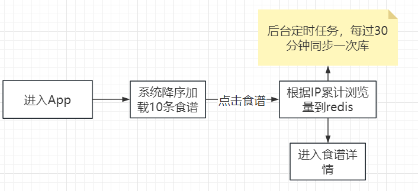
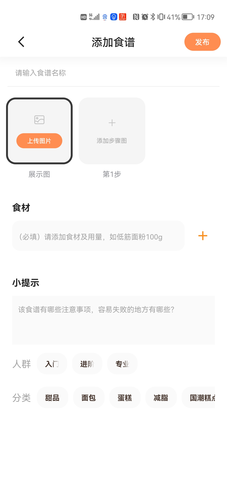
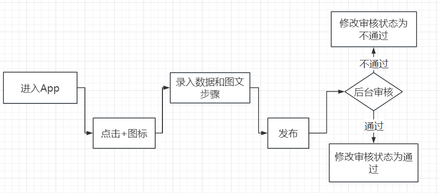
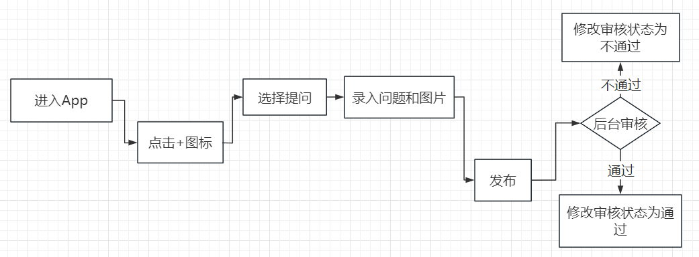

# 项目设计文档

## 知是荔枝

### 项目背景描述

> 知是荔枝是一个集【烘培食谱】、【社交】的圈子APP，可以学习烘培制作、并关注、评论自己喜爱的食谱和博主

### 模块一：首页

 

#### 业务描述

系统根据浏览量以瀑布流方式降序显示==十条==食谱，当滚动条到底一次再加载==十条==，以此类推。

每次访问的食谱，浏览量会加1

关于浏览量的实现，我们使用`AOP`环绕通知 + `redis`的方式，监控我们的食谱详情这个接口，对ip进行限制、如果说这个ip已经访问过了，那这个ip将不在增加浏览量，最后我们使用定时任务去将`redis`食谱的浏览量同步到数据库中。

> redis实现思路：
>
> 1. 设置一个临时24小时的redis的key，比如key为ip127.0.0.1，value任意。
>
> 2. 在对key为pv浏览量做增1的时候，先检查当前ip是否存在redis中，有则代表刚刚已经统计过，不做浏览量的增加。
> 3. 如果当前访问者的ip不存在redis中，那么对pv增1，然后把当前ip写入redis的临时key中

#### 前置条件

需要登录，并获得会员权限

#### 流程图

 

#### 表设计

##### 分类表：T_CATEGORY

| CATEGORY_ID | CATEGORY_NAME | CREATE_TIME | LAST_UPDATE_TIME | CREATOR | LAST_REVISER |
| :---------: | :-----------: | :---------: | :--------------: | ------- | ------------ |
|  自增主键   |   分类名称    |  创建时间   |   最后修改时间   | 创建人  | 最后修改人   |
|   bigint    |    varchar    |  datetime   |     datetime     | bigint  | bigint       |

##### 食谱表：T_COOKBOOK
| COOKBOOK_ID | COOKBOOK_TITLE | HINT    | LEVEL                   | MATERIAL | PV     | LIKE_COUNT | COLLECT_COUNT | PROCESS | CREATE_TIME | LAST_UPDATE_TIME | CREATOR | LAST_REVISER |
| ----------- | -------------- | ------- | ----------------------- | -------- | ------ | ---------- | ------------- | ------- | ----------- | ---------------- | ------- | ------------ |
| 自增主键    | 食谱标题       | 小提示  | 人群等级入门0进阶1专业2 | 食材     | 浏览量 | 点赞量     | 收藏量        | 审核    | 创建时间    | 最后修改时间     | 创建人  | 最后修改人   |
| bigint      | varchar        | varchar | char(1)                 | varchar  | bigint | bigint     | biging        | char(1) | datetime    | datetime         | bigint  | bigint       |
> 字段解释：
>
> ==PROCESS==：审核状态，0代表未审核，1代表审核通过，2代表审核不通过
>
> **审核可以人工审核，也可以使用百度ai接口自动化审核**

##### 步骤表：T_COOKBOOK_STEP

| STEP_ID  | COOKBOOK_ID | STEP_CONTENT |  STEP_IMAGE  | STEP_ORDER     |
| :------: | :---------: | :----------: | :----------: | -------------- |
| 自增主键 |  所属食谱   |   步骤描述   | 步骤图片路径 | 步骤，第几步骤 |
|  bigint  |   bigint    |   varchar    |   varchar    | bigint         |

> 一个步骤就是一条记录，一条记录有当前步骤的描述，和当前步骤的图片
>
> STEP_ORDER存储1，2，3....，代表当前记录是第几步骤

##### 食谱分类表：T_COOKBOOK_CATEGORY

| ID       | COOKBOOK_ID | CATEGORY_ID |
| -------- | ----------- | ----------- |
| 自增主键 | 食谱ID      | 分类ID      |
| bigint   | bigint      | bigint      |

> 备注：一道食谱可能属于多个**分类**,一个**分类**同时也包含多个食谱

### 模块二：发布食谱

 

#### 业务描述

用户点击首页“+”号图标，发布新的食谱

#### 前置条件

需要登录，并获得会员权限

#### 流程图

  

#### 表设计

参考首页表结构

### 模块三：个人发布

  

#### 业务描述

点击首页“+”图标，可以发布==问答==和==动态==

1. 问答 

   用户发布提问，输入问题和描述，还可以添加最多3张图片

2. 动态

   用户发布动态，输入动态名称，和动态描述，还可以添加最多6张图片

#### 前置条件

需要登录，并获得会员权限

#### 流程图

 

#### 表设计

##### 话题表：T_SUBJECT

| SUBJECT_ID | SUBJECT_NAME | CREATE_TIME | LAST_UPDATE_TIME | CREATOR | LAST_REVISER |
| :--------: | :----------: | :---------: | :--------------: | ------- | ------------ |
|  自增主键  |   题目名称   |  创建时间   |   最后修改时间   | 创建人  | 最后修改人   |
|   bigint   |   varchar    |  datetime   |     datetime     | bigint  | bigint       |

##### 问题/动态表：T_QUESTION

| QUESTION_ID | CONTENT  | DESCRIBE     | SUBJECT_ID   | TYPE      | PROCESS  | PV     | CREATE_TIME | LAST_UPDATE_TIME | CREATOR | LAST_REVISER |
| :---------: | :------: | ------------ | ------------ | --------- | -------- | ------ | :---------: | :--------------: | ------- | ------------ |
|  自增主键   | 题目内容 | 问题补充描述 | 题目所属话题 | 问题/动态 | 审核状态 | 浏览量 |  创建时间   |   最后修改时间   | 创建人  | 最后修改人   |
|   bigint    | varchar  | varchar      | bigint       | char(1)   |          | bigint |  datetime   |     datetime     | bigint  | bigint       |

> 问题和动态功能差不多，使用==type==属性区分，如0为问题，1为动态

##### 问题/动态附件图片表：T_QUESTION_IMAGE

| QUESTION_IMAGE_ID | QUESTION_ID | IMAGE_PATH |
| ----------------- | ----------- | ---------- |
| 自增主键          | 题目ID      | 图片地址   |
| bigint            | bigint      | varchar    |

##### 问题/动态， 回复/评论表：T_QUESTION_ANSWER

| QUESTION_ANSWER_ID | QUESTION_ID | ANSWER  | LIKE_COUNT | CREATE_TIME | LAST_UPDATE_TIME | CREATOR | LAST_REVISER |
| ------------------ | ----------- | ------- | ---------- | ----------- | ---------------- | ------- | ------------ |
| 自增主键           | 题目ID      | 回答    | 点赞量     | 创建时间    | 最后修改时间     | 创建人  | 最后修改人   |
| bigint             | bigint      | varchar | bigint     | datetime    | datetime         | bigint  | bigint       |

### 模块三：荔枝圈

  

#### 业务描述

圈子首页分别显示

1. 话题

   显示前5名热点话题

2. 问答

   显示一条问答，左右滑动可以获取下一条问题

3. 动态

   使用瀑布流方式查询动态

#### 前置条件

需要登录，并获得会员权限

#### 流程图

 

#### 表设计

参考上述食谱和问答模块

### 模块四：管理员后台系统-话题管理

#### 业务描述

管理app上所有的笑话数据,在后端管理员可以**CRUD**笑话数据

#### 前置条件

需要登录后台管理系统

### 模块五：管理员后台系统-食谱管理

#### 业务描述

管理app上所有的食谱数据,在后端管理员可以**CRUD**食谱数据

#### 前置条件

需要登录后台管理系统

### 模块六：管理员后台系统-荔枝圈管理

#### 业务描述

管理app上所有的问答/动态,在后端管理员可以**CRUD**问答/动态数据

#### 前置条件

需要登录后台管理系统
