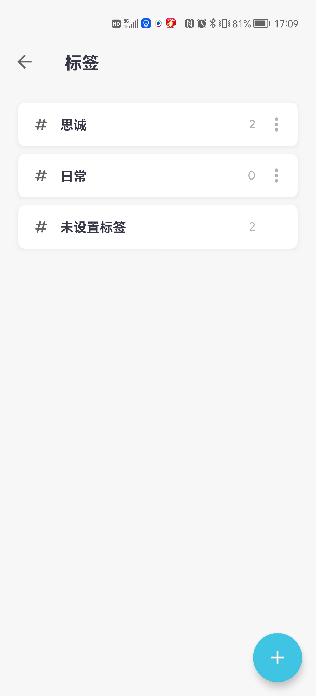
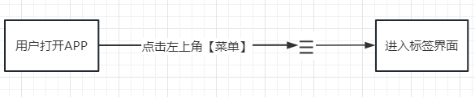
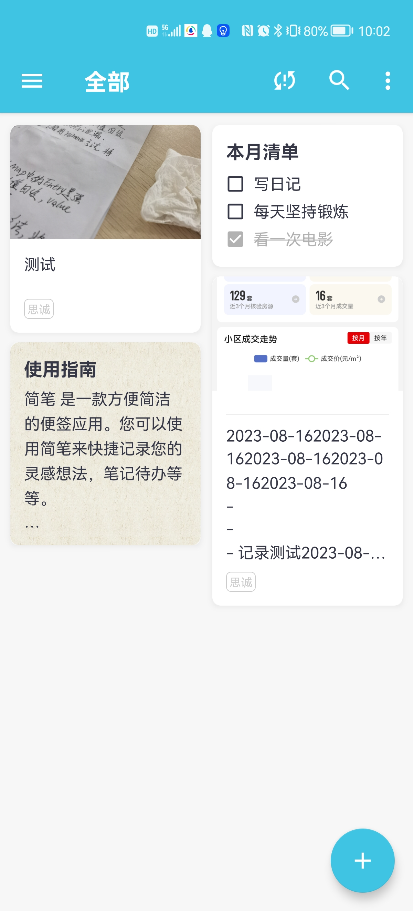
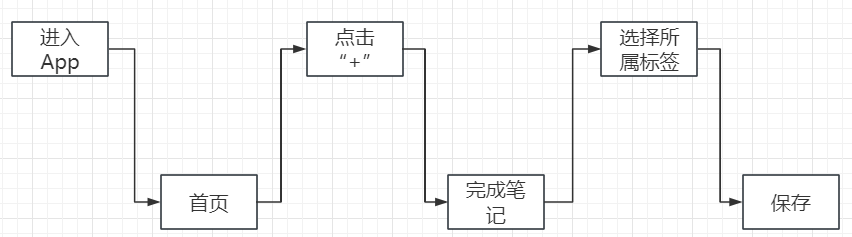

# 项目设计文档

## 简笔

### 项目背景描述

> 简笔 是一款方便简洁的便签应用。您可以使用简笔来快捷记录您的灵感想法，笔记代办等等。
>
> 简笔支持添加：
>
> 1. 纯文字笔记
> 2. 多张图片
> 3. 文件附件
> 4. 手绘图画
> 5. 清单代办
>
> 丰富的笔记内容随时随地记录您的想法。
>
> 您还可以添加标签来归类您的笔记，添加背景图让您的笔记更加多彩，添加密码锁时刻守护您的隐私。
>
> ==注意==：该APP有免费版和付费版，免费版不需要登录，数据也不会存储在服务器，所以该文档的设计是基于付费版来设计的

### 模块一：用户标签设置

 

#### 业务描述

用户记录笔记时，可以把笔记分类在不同的==标签==，方便管理和查找

#### 前置条件

无

#### 流程图

 

#### 表设计

##### 标签表：T_LABEL

| LABEL_ID | LABEL_NAME | create_time | last_update_time | creator | last_reviser |
| :------: | :--------: | :---------: | :--------------: | ------- | ------------ |
| 自增主键 |  标签名称  |  创建时间   |   最后修改时间   | 创建人  | 最后修改人   |
|  bigint  |    int     |  datetime   |     datetime     | bigint  | bigint       |

### 模块二 笔记

 

#### 业务描述

点击“+”创建笔记，笔记可以使用文字+图片+绘画+附件的方式

点击放大镜可以根据关键字完成笔记搜索

文字存储在一个字段中，**图片**，**绘画**，**附件**存储在附件表中

#### 前置条件

需要登录，并获得会员权限

#### 流程图

  

#### 表设计

#### 表设计

##### 笔记表：T_NOTE

| NOTE_ID  | CONTENT  | TITLE    | LABLE_ID | CREATE_TIME | LAST_UPDATE_TIME | CREATOR | LAST_REVISER |
| :------: | :------: | -------- | :------: | :---------: | :--------------: | ------- | ------------ |
| 自增主键 | 笔记内容 | 笔记标题 | 所属标签 |  创建时间   |   最后修改时间   | 创建人  | 最后修改人   |
|  bigint  | varchar  | varchar  | tinyint  |  datetime   |     datetime     | bigint  | bigint       |

##### 用户附件表：T_NOTE_ANNEX

| ANNEX_ID | NOTE_ID | ANNEX_PATH     | ANNEX_TYPE                           |
| -------- | ------- | -------------- | ------------------------------------ |
| 自增主键 | 笔记id  | 附件所在的路径 | 附件类型 (0图片1绘画2照片3文件) |
| bigint   | bigint  | varchar        | char(1)                              |

> 备注：
>
> 1. 笔记和标签属于多对1关系
>
> 2. 附件使用单独的表存储，一份笔记有多个附件
