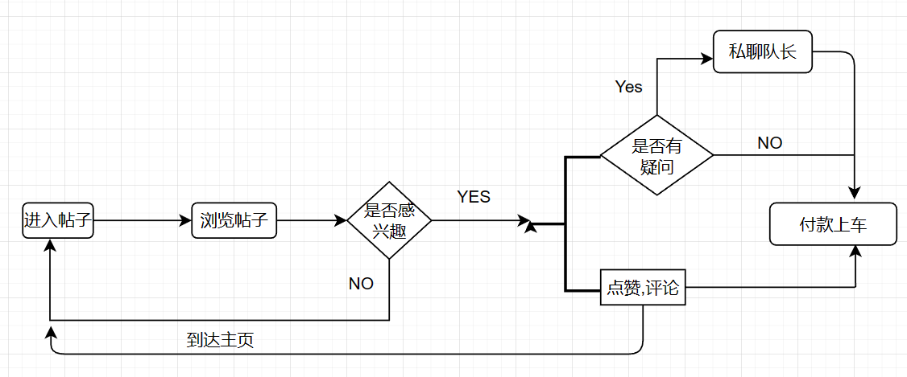

# 墨鱼旅行_ 项目设计文档 

## 1.项目背景:

> 墨鱼旅行（更名前为：墨鱼环球）定位旅行交友，是全新一代3.0的在线旅行产品。墨鱼旅行注重人与人之间的交流，为全球的旅行爱好者打造一个即时互动分享交流的平台，用户通过发布图文、视频动态、开启旅行直播能够在平台获得广泛曝光，找到来自世界各地的志同道合的驴友。
>
> 此外，墨鱼旅行作为一款旅行应用软件，为用户提供全球机票、门票、线路预定服务。同时，尊重用户的选择权，让用户选择时间、行程的时候兼顾同行团友的选择。打造主题旅行小团，能够为追求个性化定制化旅行服务的驴友提供品质服务。

## 2.功能模块:

### 2.1登录 注册

#### 2.1.1业务描述

- 用户进入app,有两个选择,可以通过手机号也可以通过微信跳转登入,如果已经有注册过的账号则直接进入app主页,如果没有注册过则会要求填写基本资料如:昵称,年龄(出生日期).也可以跳过直接进入app以后完善

  

#### 2.1.2流程图

#### 2.1.3表设计

- #### 用户表

| user_id  |  nick_name  |   gender   | birthday |   address   |    hobby    |
| :------: | :---------: | :--------: | :------: | :---------: | :---------: |
| 自增主键 |    昵称     |    性别    | 出生日期 |    地址     |    爱好     |
|   int    | varchar(50) | varchar(1) |   date   | varchar(50) | varchar(50) |

|     job     | school_name |  signature  |  head_pic   |  hometowm   | user_show_id |
| :---------: | :---------: | :---------: | :---------: | :---------: | :----------: |
|    行业     |    学校     |  个性签名   |  头像地址   |    家乡     |  展示信息id  |
| varchar(10) | varchar(20) | varchar(50) | varchar(50) | varchar(20) |     int      |

| admin             | password     | telphone_number |
| ----------------- | ------------ | --------------- |
| 管理员1,普通用户0 | 密码         | 电话号码        |
| int               | varchar(255) | char(11)        |

- 喜欢表

| id     | post_love_id | user_id |
| ------ | ------------ | ------- |
| 喜欢表 | 帖子id       | 用户id  |
| int    | int          | int     |

### 2.2我的

#### 2.2.1业务描述

- 背景图片：用户可以在"我的"界面设置个性化的背景图片，通过选择或上传喜爱的照片或景点图像，让个人页面更加独特、吸引人。

- 头像：用户可以在"我的"界面设置自己的头像，支持从相册中选择或拍摄新的照片作为头像，展示个人风采和特色。

- 昵称和账号：在"我的"界面，用户可以查看和编辑个人昵称和账号信息。用户可以根据自己的喜好进行昵称的设置，并且通过账号信息进行个人身份的识别。

- 我的发布：该功能允许用户查看自己在墨鱼旅行App上发布的旅行日记、照片、评论等内容。用户可以浏览、编辑和删除自己的发布，回顾旅行回忆，与其他用户分享精彩的旅行经历。

- 分享功能：在"我的"界面，用户可以利用分享功能将此app推荐给微信,qq群,朋友圈,qq空间

- 修改信息：在"我的"界面，用户可以随时修改个人资料和偏好设置。这包括更改昵称、头像、个人简介等，以及调整通知偏好、隐私设置等。用户可以根据自己的需求和变化，灵活地调整个人信息。

  

#### 2.2.2流程图

#### 2.2.3用户主页展示表

|     user_show_id     | fans | care | circle | like | background  |
| :------------------: | :--: | :--: | :----: | :--: | :---------: |
| 展示信息id(自增主键) | 粉丝 | 关注 |  圈子  | 喜欢 |  背景地址   |
|         int          | int  | int  |  int   | int  | varchar(50) |

### 2.3帖子-详情页

#### 2.3.1业务描述

> 在墨鱼旅游社区平台上，旅游帖子详情页是用户了解和参与旅游活动的重要界面。该详情页包含以下主要信息和功能：

- 图片轮播：旅游帖子详情页展示了多张精美的图片，用户可以通过轮播查看这些图片，以便更好地了解旅游目的地和活动风貌。
- 描述：每个旅游帖子都有详细的描述，描述了旅游活动的行程、活动亮点以及其他相关信息，让用户对旅游计划有更深入的了解。
- 旅游地点：旅游帖子中指定了旅游目的地的名称和相关信息，让用户清楚知道旅游活动的具体地点。
- 旅游时间：详细列出了旅游活动的开始时间和结束时间，以便用户可以根据自己的时间安排来选择参加活动。
- 期望人数：发布帖子的用户在详情页上会指定旅游活动的期望参与人数，让其他用户了解当前活动的参与情况。
- 人均预算：旅游帖子会显示每人参与旅游活动所需的预算，让用户对旅游费用有所预期。
- 适合人群：发布帖子的用户会说明旅游活动适合的人群，如家庭出游、情侣旅行、独自探险等，以便用户选择符合自己兴趣和需求的活动。
- 费用方式：旅游帖子会明确说明旅游费用的支付方式，如线上支付、线下支付等，以便用户提前做好准备。
- 回复功能：用户可以在旅游帖子详情页下方进行回复，分享自己的看法、提出问题或与其他用户交流旅游相关的话题。
- 点赞功能：用户可以对喜欢的旅游帖子进行点赞，展现对该帖子内容的喜爱和支持。
- 联系发帖人：在详情页上，用户可以方便地与发布帖子的用户进行联系，咨询更多关于旅游活动的细节和信息。
- 直接付款上车：为了提供更便捷的参与体验，我们平台支持直接在详情页上完成旅游费用的支付，确保用户在旅行出发时无后顾之忧。

#### 2.3.2流程图

#### 2.3.3表设计

- #### 用户与帖子的关联表

| user_post_id | user_id | post_id |
| :----------: | :-----: | ------- |
|   自增主键   | 用户id  | 帖子id  |
|     int      |   int   | int     |

- #### 帖子表

| post_id  |    title     | description  | travel_address | travel_time  | expected_attendees |
| :------: | :----------: | :----------: | :------------: | :----------: | :----------------: |
| 自增主键 |     标题     |     描述     |      地址      |     时间     |      期望人数      |
|   int    | varchar(255) | varchar(255) |  varchar(255)  | varchar(255) |        int         |

| post_id  | budget_per_perso | target_audience | payment_method |   details    |
| :------: | :--------------: | :-------------: | :------------: | :----------: |
| 自增主键 |     人均费用     |    适合人群     |    付费方式    |     详情     |
|   int    |   varchar(255)   |  varchar(255)   |  varchar(255)  | varchar(255) |

- #### 帖子与评论的关联表

| post_comments_id | post_id | comments_id |
| :--------------: | :-----: | :---------: |
|     自增主键     | 帖子id  |   评论id    |
|       int        |   int   |     int     |

- #### 评论表

| comments_id | user_idcontent |   content    | comment_time |
| :---------: | :------------: | :----------: | :----------: |
|   自增id    |    评论用户    |   评论内容   |   评论时间   |
|     int     |      int       | varchar(255) |     date     |

### 2.4组队列表

#### 2.4.1业务描述 

- 帖子分类：墨鱼旅行主页列表根据不同的主题和类型对帖子进行分类，以便用户更方便地找到他们感兴趣的内容。常见的帖子分类可以包括全部,自驾拼车,周末短途,创新主题,找人带完等。用户可以点击相应分类标签，快速筛选出自己感兴趣的帖子
- 热门帖子：墨鱼旅行主页列表会展示当前受欢迎和热门的帖子，根据帖子的浏览量、点赞数、评论数等指标进行排序。这样，用户可以了解到其他旅行者推荐的热门目的地、景点、活动或个人旅行经验，获取灵感和建议。

#### 2.4.2流程图

#### 2.4.3表设计

- #### 列表

| list_id | classification | location     | post_id |
| ------- | -------------- | ------------ | ------- |
| 列表id  | 分类           | 地区         | 帖子id  |
| int     | varchar(255)   | varchar(255) | int     |

