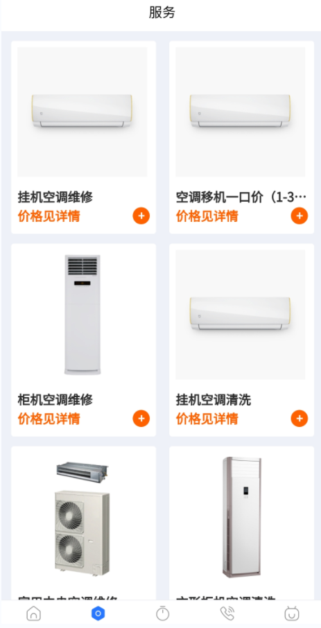

# 一步到家空调维修设计文档

### 项目背景描述

> 

## 模块一:  用户模块

#### 界面展示

    

## 模块二: 预约模块

#### 界面展示

  

  

  

   

## 模块三 管理员用户模块

## 模块四: 权限模块

#### 业务描述

 主要用户控制各个模块之间的权限分配 ,主要是用于什么角色的账户可以操作什么功能

#### 前置条件

需要管理员登录

#### 流程图

无

#### 表设计

#### 用户表 user

| user_id  | user_phone | user_password | create_time |
| :------: | :--------: | :-----------: | :---------: |
| 自增主键 |   手机号   |     密码      |  创建时间   |
|  bigint  |  varchar   |    varchar    |  datetime   |

#### 角色表 role

| role_id  | role_name | role_code      | create_time | update_time | remark  |
| -------- | --------- | -------------- | ----------- | ----------- | ------- |
| 自增主键 | 角色名称  | 角色权限字符串 | 创建时间    | 更新时间    | 备注    |
| bigint   | varchar   | varchar        | datetime    | datetime    | varchar |

#### 用户角色关系表  user_role

| id       | user_id | role_id |
| -------- | ------- | ------- |
| 自增主键 | 用户id  | 角色id  |
| bigint   | bigint  | bigint  |

>注: 用户和角色实现多对多关联 通过它表示该用户是管理员

####  权限菜单表 menu

| menu_id  | menu_name | icon     | parent_id | order_num | path     | component | menu_type                     | create_time | update_time | remark  |
| -------- | --------- | -------- | --------- | --------- | -------- | --------- | ----------------------------- | ----------- | ----------- | ------- |
| 自增主键 | 菜单名称  | 菜单图标 | 父菜单id  | 排序      | 路由地址 | 组件路径  | 菜单类型（m目录 c菜单 f按钮） | 创建时间    | 更新时间    | 备注    |
| bigint   | varchar   | varchar  | bigint    | bigint    | varchar  | varchar   | char                          | datetime    | datetime    | varchar |

#### 权限角色关系表  role_menu

| id       | role_id | menu_id |
| -------- | ------- | ------- |
| 自增主键 | 角色id  | 权限id  |
| bigint   | bigint  | bigint  |

>注: 角色和权限实现多对多关联