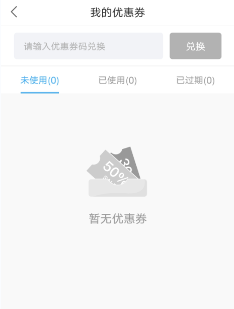
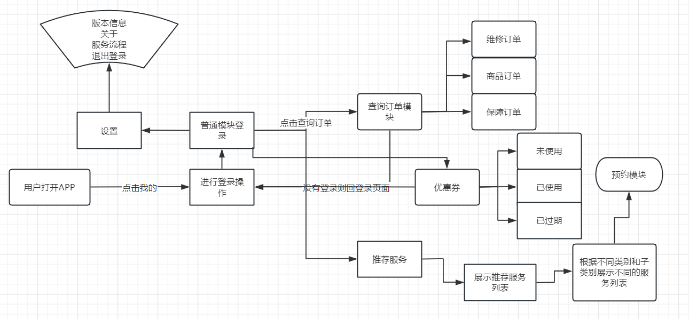
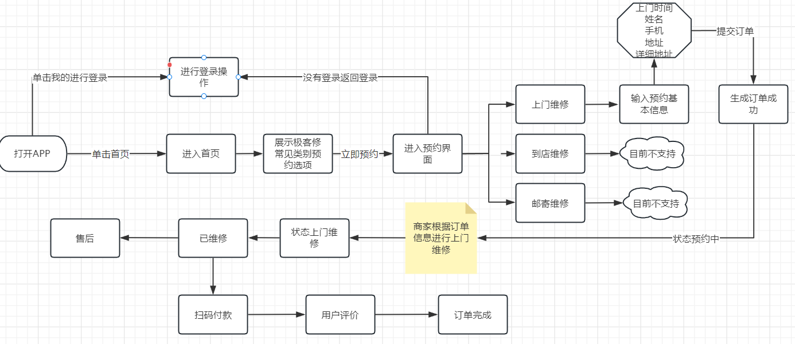
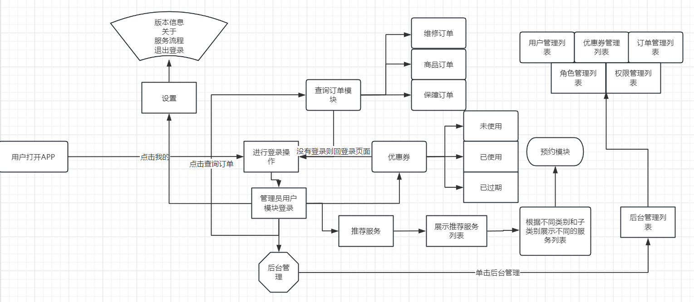

# 极客修空调维修设计文档

### 项目背景描述

> 极客修空调维修，专业维修全国连锁。为您提供空调维修，空调加氟，空调不制冷/热维修，空调漏水维修，空调噪音大维修，空调安装，空调移机，空调清洗等服务。 免费预约，一键下单，修好付费。 服务优势： *线上预约，上门维修 用户可在APP进行预约。现已在北京、广州、上海、深圳、重庆、成都等各大城市开通工程师上门维修服务。 *高品质零配件 高品质零配件，统一采购，质量有保障。 *维修过程全程录像 维修全程录像，用户通过官网可查询并随时观看维修视频，安全更放心。 *收费公开透明 按实际故障点结算费用，统一报价，一目了然。如需维修工程师评估具体故障点情况，维修工程师将给出维修方案与报价，由客户自主选择维修方式。

## 模块一:  用户模块

#### 业务描述

负责实现普通用户手机登录,订单查询,优惠券兑换和展示,联系客服以及优质商品的推荐服务,还包括系统设置 版本信息的展示关于我们,服务流程,隐私政策,账户注销 退出登录等功能

#### 界面展示

 

 

 

#### 前置条件

需要用户登录

#### 流程图

 

#### 表设计

#### 用户表：user

| user_id  | user_phone | user_password | create_time |
| :------: | :--------: | :-----------: | :---------: |
| 自增主键 |   手机号   |     密码      |  创建时间   |
|  bigint  |  varchar   |    varchar    |  datetime   |

#### 优惠券表：coupon

| coupon_id | coupon_name | discount_amount | coupon_status              | create_time | expire_time | user_id |
| --------- | ----------- | --------------- | -------------------------- | ----------- | ----------- | ------- |
| 自增主键  | 优惠券名    | 优惠券金额      | 状态(未使用,已使用,已过期) | 创建时间    | 过期时间    | 用户id  |
| bigint    | varchar     | double          | char                       | datetime    | datetime    | bigint  |

>注: 优惠券可以系统随机分配近期在线的用户,也可以通过程序生成优惠券兑换码手动兑换生成新的优惠券,和普通用户1对多的关系

#### 订单表: order

| order_id | order_no      | order_status                                           | order_type          | order_amount | payment_amount | discount_amount | address  | create_time | payment_time | user_id | score |
| -------- | ------------- | ------------------------------------------------------ | ------------------- | ------------ | -------------- | --------------- | -------- | ----------- | ------------ | ------- | ----- |
| 自增主键 | 订单编号,唯一 | 订单状态(预约中,待检测,上门维修,已维修,已付款,售后...) | 订单类型(维修,商品) | 订单金额     | 实付金额       | 优惠金额        | 维修地址 | 创建时间    | 支付时间     | 用户id  | 好评  |
| bigint   | varchar       | char                                                   | char                | double       | double         | double          | varchar  | datetime    | datetime     | bigint  | int   |

>注:这里订单表只负责订单查询  包括维修订单 和商品订单

#### 选择类别: types

| type_id         | type_name | parent_id | create_time | creator |
| --------------- | --------- | --------- | ----------- | ------- |
| 分类id 主键自增 | 分类名称  | 父类id    | 创建时间    | 创建者  |
| bigint          | varchar   | bigint    | datetime    | varchar |

>注: 该功能用户实现推荐服务,选择不同的界面进入类别展示界面比如:手机维修,电脑维修,平板维修,家电维修,水电维修,管道疏通...每个类别都会多个子类别  选择不同类别进入选择故障界面

## 模块二: 预约模块

#### 业务描述

 该模块主要负责首页空调维修分类展示,根据不同的分类进行预约界面,预约界面展示不同类型故障类型价格报表

以及商品详细信息 以及服务流程, 还有更多服务直接进入分类界面,  单击立即预约可以选择不同的类型上门维修,到店维修,邮寄维修(空调等一些特殊设备不支持到店维修)  输入预约的基本信息 提交订单  后端生成订单数据 预约成功，维修结束后 可以对维修的订单进行评价  以及付款   售后等功能  订单结束

#### 界面展示

 

 

 

  

#### 前置条件

需要普通用户登录

#### 流程图

 

#### 表设计

#### 用户表 user

| user_id  | user_phone | user_password | create_time |
| :------: | :--------: | :-----------: | :---------: |
| 自增主键 |   手机号   |     密码      |  创建时间   |
|  bigint  |  varchar   |    varchar    |  datetime   |

#### 订单表: order

| order_id | order_no      | order_status                                           | order_type          | order_amount | payment_amount | discount_amount | address  | create_time | payment_time | user_id | score |
| -------- | ------------- | ------------------------------------------------------ | ------------------- | ------------ | -------------- | --------------- | -------- | ----------- | ------------ | ------- | ----- |
| 自增主键 | 订单编号,唯一 | 订单状态(预约中,待检测,上门维修,已维修,已付款,售后...) | 订单类型(维修,商品) | 订单金额     | 实付金额       | 优惠金额        | 维修地址 | 创建时间    | 支付时间     | 用户id  | 好评  |
| bigint   | varchar       | char                                                   | char                | double       | double         | double          | varchar  | datetime    | datetime     | bigint  | int   |

>注: 预约成功后 会生成订单,通过订单状态来控制  整个维修流程

#### 优惠券表：coupon

| coupon_id | coupon_name | discount_amount | coupon_status              | create_time | expire_time | user_id |
| --------- | ----------- | --------------- | -------------------------- | ----------- | ----------- | ------- |
| 自增主键  | 优惠券名    | 优惠券金额      | 状态(未使用,已使用,已过期) | 创建时间    | 过期时间    | 用户id  |
| bigint    | varchar     | double          | char                       | datetime    | datetime    | bigint  |

>注: 用户付款时,需要优惠券的优惠金额,更新优惠券状态

#### 评价表：evaluate

| id       | user_id | order_id | content  | created_time | Like |
| -------- | ------- | -------- | -------- | ------------ | ---- |
| 自增主键 | 用户id  | 订单编号 | 评价内容 | 创建时间     | 点赞 |
| bigint   | bigint  | bigint   | varchar  | datetime     | int  |

## 模块三 管理员用户模块

#### 业务描述

负责实现管理员用户手机登录,进入后台功能,可以根据时间查询查看所有订单进行订单管理,新增分类,手动发放优惠券,生成优惠券兑换码,以及用户列表展示搜索等功能

 

#### 前置条件

需要管理员用户登录

#### 流程图

 

#### 表设计

#### 用户表 user

| user_id  | user_phone | user_password | create_time |
| :------: | :--------: | :-----------: | :---------: |
| 自增主键 |   手机号   |     密码      |  创建时间   |
|  bigint  |  varchar   |    varchar    |  datetime   |

#### 角色表 role

| role_id  | role_name | role_code      | create_time | update_time | remark  |
| -------- | --------- | -------------- | ----------- | ----------- | ------- |
| 自增主键 | 角色名称  | 角色权限字符串 | 创建时间    | 更新时间    | 备注    |
| bigint   | varchar   | varchar        | datetime    | datetime    | varchar |

#### 用户角色关系表 user_role

| id       | user_id | role_id |
| -------- | ------- | ------- |
| 自增主键 | 用户id  | 角色id  |
| bigint   | bigint  | bigint  |

>注: 用户和角色实现多对多关联 通过它表示该用户是管理员

#### 订单表: order

| order_id | order_no      | order_status                                           | order_type          | order_amount | payment_amount | discount_amount | address  | create_time | payment_time | user_id | score |
| -------- | ------------- | ------------------------------------------------------ | ------------------- | ------------ | -------------- | --------------- | -------- | ----------- | ------------ | ------- | ----- |
| 自增主键 | 订单编号,唯一 | 订单状态(预约中,待检测,上门维修,已维修,已付款,售后...) | 订单类型(维修,商品) | 订单金额     | 实付金额       | 优惠金额        | 维修地址 | 创建时间    | 支付时间     | 用户id  | 好评  |
| bigint   | varchar       | char                                                   | char                | double       | double         | double          | varchar  | datetime    | datetime     | bigint  | int   |

#### 选择类别: types

| type_id         | type_name | parent_id | create_time | creator |
| --------------- | --------- | --------- | ----------- | ------- |
| 分类id 主键自增 | 分类名称  | 父类id    | 创建时间    | 创建者  |
| bigint          | varchar   | bigint    | datetime    | varchar |

#### 优惠券表：coupon

| coupon_id | coupon_name | discount_amount | coupon_status              | create_time | expire_time | user_id |
| --------- | ----------- | --------------- | -------------------------- | ----------- | ----------- | ------- |
| 自增主键  | 优惠券名    | 优惠券金额      | 状态(未使用,已使用,已过期) | 创建时间    | 过期时间    | 用户id  |
| bigint    | varchar     | double          | char                       | datetime    | datetime    | bigint  |

## 模块四: 权限模块

#### 业务描述

 主要用户控制各个模块之间的权限分配 ,主要是用于什么角色的账户可以操作什么功能

#### 前置条件

需要管理员登录

#### 流程图

无

#### 表设计

#### 用户表 user

| user_id  | user_phone | user_password | create_time |
| :------: | :--------: | :-----------: | :---------: |
| 自增主键 |   手机号   |     密码      |  创建时间   |
|  bigint  |  varchar   |    varchar    |  datetime   |

#### 角色表 role

| role_id  | role_name | role_code      | create_time | update_time | remark  |
| -------- | --------- | -------------- | ----------- | ----------- | ------- |
| 自增主键 | 角色名称  | 角色权限字符串 | 创建时间    | 更新时间    | 备注    |
| bigint   | varchar   | varchar        | datetime    | datetime    | varchar |

#### 用户角色关系表  user_role

| id       | user_id | role_id |
| -------- | ------- | ------- |
| 自增主键 | 用户id  | 角色id  |
| bigint   | bigint  | bigint  |

>注: 用户和角色实现多对多关联 通过它表示该用户是管理员

####  权限菜单表 menu

| menu_id  | menu_name | icon     | parent_id | order_num | path     | component | menu_type                     | create_time | update_time | remark  |
| -------- | --------- | -------- | --------- | --------- | -------- | --------- | ----------------------------- | ----------- | ----------- | ------- |
| 自增主键 | 菜单名称  | 菜单图标 | 父菜单id  | 排序      | 路由地址 | 组件路径  | 菜单类型（m目录 c菜单 f按钮） | 创建时间    | 更新时间    | 备注    |
| bigint   | varchar   | varchar  | bigint    | bigint    | varchar  | varchar   | char                          | datetime    | datetime    | varchar |

#### 权限角色关系表  role_menu

| id       | role_id | menu_id |
| -------- | ------- | ------- |
| 自增主键 | 角色id  | 权限id  |
| bigint   | bigint  | bigint  |

>注: 角色和权限实现多对多关联