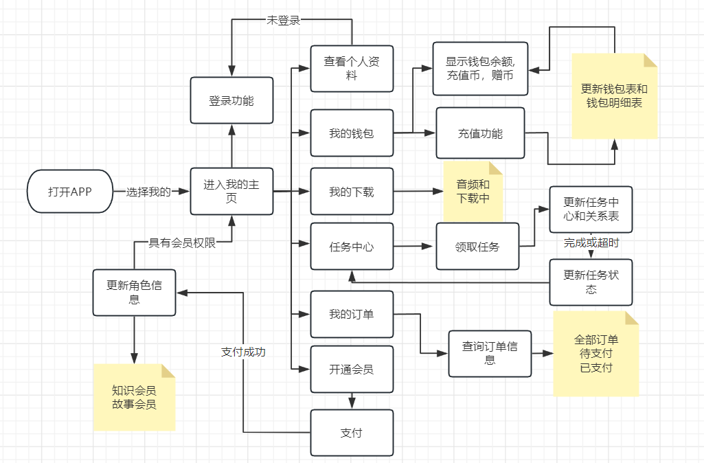
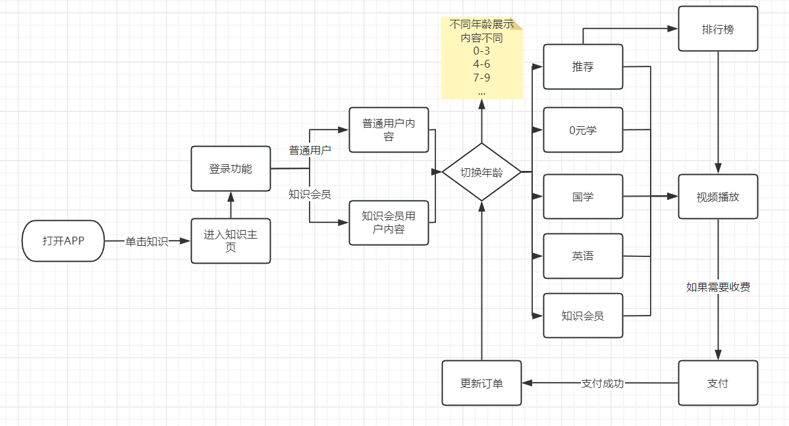
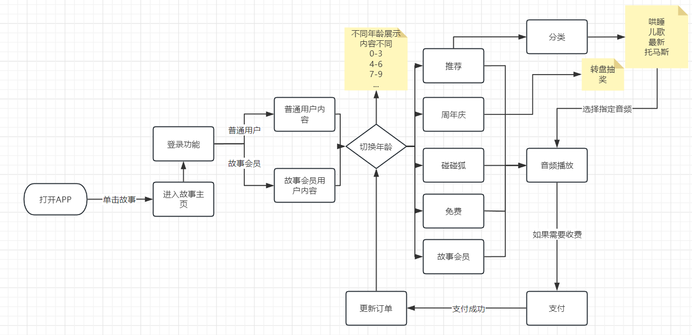
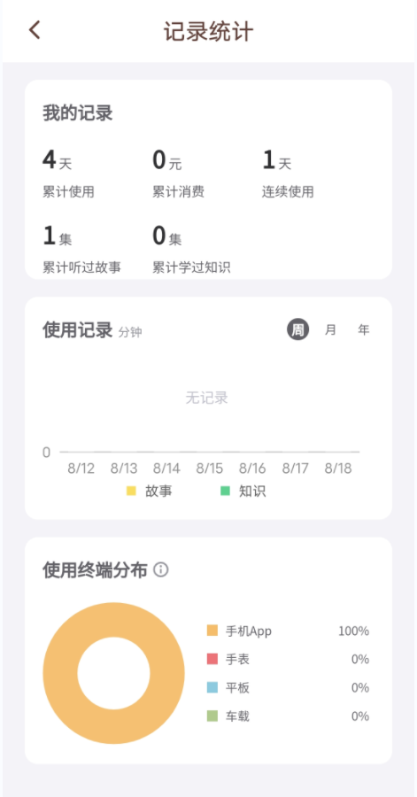
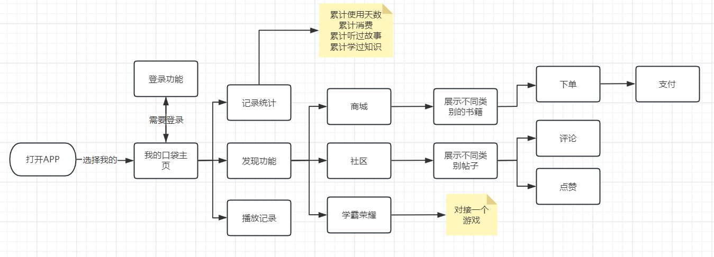

# 口袋故事设计文档

### 项目背景描述

> 口袋故事是一个儿童有声故事平台，面向0-12岁孩子和家长共用的音频播放类APP，汇集海量、正版、原创儿童音频内容，供家长选择，内容涵盖儿童故事、儿歌、英语、国学、广播剧等多个类别。APP支持安卓和iOS 双平台，同时支持在手机、平板、TV和车载多终端上使用，口袋故事的内容合作方主要是儿童文学作家和出版社，也因此有很多为家长和孩子喜欢的优质儿童音频内容。有同名的热门动画片，也有同名的畅销儿童图书

## 模块一:  普通用户模块(1-2人)

#### 业务描述

负责实现普通用户相关登录,用户设置,账户安全,我的钱包，兑换商城,任务中心,我的订单,下载记录,购买记录,兑换优惠券等功能,开通故事会员和知识会员

#### 界面展示

 

#### 前置条件

需要普通用户或者会员登录

#### 流程图

 

#### 表设计     

##### 用户表：user

| user_id  | user_phone | user_password | user_head | user_name | user_introduce | user_sex | user_area | user_birthday | create_time |
| :------: | :--------: | :-----------: | --------- | --------- | -------------- | -------- | --------- | ------------- | :---------: |
| 自增主键 |   手机号   |     密码      | 头像      | 昵称      | 自我介绍       | 性别     | 地区      | 出生日期      |  创建时间   |
|  bigint  |  varchar   |    varchar    | varchar   | varchar   | varchar        | char     | varchar   | datetime      |  datetime   |

##### 优惠券表：coupon

| coupon_id | coupon_name | discount_amount | coupon_status              | create_time | expire_time | user_id |
| --------- | ----------- | --------------- | -------------------------- | ----------- | ----------- | ------- |
| 自增主键  | 优惠券名    | 优惠券金额      | 状态(未使用,已使用,已过期) | 创建时间    | 过期时间    | 用户id  |
| bigint    | varchar     | double          | char                       | datetime    | datetime    | bigint  |

>注: 优惠券可以系统随机分配近期在线的用户,也可以通过程序生成优惠券兑换码手动兑换生成新的优惠券,和普通用户1对多的关系

#### 订单表: order

| order_id | order_no      | order_status                 | order_type                       | order_amount | payment_amount | discount_amount | create_time | payment_time | user_id | score |
| -------- | ------------- | ---------------------------- | -------------------------------- | ------------ | -------------- | --------------- | ----------- | ------------ | ------- | ----- |
| 自增主键 | 订单编号,唯一 | 订单状态(已支付 未支付 取消) | 订单类型(充值,购买视频,购买音频) | 订单金额     | 实付金额       | 优惠金额        | 创建时间    | 支付时间     | 用户id  | 好评  |
| bigint   | varchar       | char                         | char                             | double       | double         | double          | datetime    | datetime     | bigint  | int   |

#### 角色表 role

| role_id  | role_name | role_code      | create_time | update_time | remark  |
| -------- | --------- | -------------- | ----------- | ----------- | ------- |
| 自增主键 | 角色名称  | 角色权限字符串 | 创建时间    | 更新时间    | 备注    |
| bigint   | varchar   | varchar        | datetime    | datetime    | varchar |

>用户角色主要包含,普通用户,故事会员,知识会员,超级管理员等不同角色   用户和角色是多对多的关系，一个用户可以购买多种会员身份

#### 用户和角色关系表 user_role

| id       | user_id | role_id |
| -------- | ------- | ------- |
| 自增主键 | 用户id  | 角色id  |
| bigint   | bigint  | bigint  |

#### 钱包表  wallet

| wallet_id | user_id | wallet_balance | wallet_recharge | wallet_give | update_time |
| --------- | ------- | -------------- | --------------- | ----------- | ----------- |
| 自增主键  | 用户id  | 钱包余额       | 充值币          | 赠币        | 更新时间    |
| bigint    | bigint  | double         | double          | double      | datetime    |

#### 钱包明细表 detail

| detail_id | wallet_id | detail_type                | detail_time | remark  |
| --------- | --------- | -------------------------- | ----------- | ------- |
| 自增主键  | 钱包id    | 出入账类型(充值,提现,收入) | 出入账时间  | 备注    |
| bigint    | bigint    | char                       | datetime    | varchar |

#### 视频下载列表 video_download

| download_id | user_id | download_name | download_address | update_time |
| ----------- | ------- | ------------- | ---------------- | ----------- |
| 自增主键    | 用户id  | 视频名称      | 下载地址         | 更新时间    |
| bigint      | bigint  | varchar       | varchar          | datetime    |

#### 任务中心表 Task

| task_id  | task_content | task_start   | task_end     | remark  |
| -------- | ------------ | ------------ | ------------ | ------- |
| 自增主键 | 任务内容     | 任务开始时间 | 任务结束时间 | 备注    |
| bigint   | varchar      | datetime     | datetime     | varchar |

#### 任务用户关系表 Task_user

| Task_user_id | task_id | user_id | task_type               | task_time    |
| ------------ | ------- | ------- | ----------------------- | ------------ |
| 自增主键     | 任务id  | 用户id  | 完成状态(已完成,待完成) | 完成任务时间 |
| bigint       | bigint  | bigint  | char                    | datetime     |

>任务和用户是多对多的关系,一个用户可以截取多个任务进行完成

## 模块二 知识模块

#### 业务描述

负责实现根据不同年龄推送不同的知识内容 比如:0元学,知识会员系列,国学,英语,科普等信息，以及视频排行榜,会员排行榜,知识排行榜等功能

#### 界面展示

  

 

#### 前置条件

需要普通用户或者会员登录

#### 流程图

 

#### 表设计  

#### 用户表 user

| user_id  | user_phone | user_password | user_head | user_name | user_introduce | user_sex | user_area | user_birthday | create_time |
| :------: | :--------: | :-----------: | --------- | --------- | -------------- | -------- | --------- | ------------- | :---------: |
| 自增主键 |   手机号   |     密码      | 头像      | 昵称      | 自我介绍       | 性别     | 地区      | 出生日期      |  创建时间   |
|  bigint  |  varchar   |    varchar    | varchar   | varchar   | varchar        | char     | varchar   | datetime      |  datetime   |

#### 年龄表 age

| age_id | age_type                  | remark  | update_time |
| ------ | ------------------------- | ------- | ----------- |
| 自增id | 年龄类型(0-3,4-6,7-9,...) | 备注    | 更新时间    |
| bigint | char                      | varchar | datetime    |

>根据不同的年龄区间选择对应不同的推荐专属内容

#### 视频表 video

| video_id | video_title | video_describe | video_link | video_Sketch_link | look_count | like_count | step_on_count | comment_count | update_time | video_Category_id |
| -------- | ----------- | -------------- | ---------- | ----------------- | ---------- | ---------- | ------------- | ------------- | ----------- | ----------------- |
| 自增id   | 视频标题    | 视频描述       | 视频链接   | 视频简略图链接    | 观看次数   | 点赞次数   | 踩数          | 评论数        | 上传时间    | 视频类别          |
| bigint   | varchar     | varchar        | varchar    | varchar           | bigint     | bigint     | bigint        | bigint        | datetime    | bigint            |

#### 视频类别表 video_Category

| video_Category_id | video_Category_name                  | age_id | update_time | remark  |
| ----------------- | ------------------------------------ | ------ | ----------- | ------- |
| 自增id            | 视频类别名称(0元学,知识会员,国学...) | 年龄类 | 更新时间    | 备注    |
| bigint            | varchar                              | bigint | datetime    | varchar |

>视频类别和视频表和年龄类表都有对应关系,  视频类别有,0元学, 知识会员,国学,英语,科普...  同时还对应不同的年龄段的0-3岁   4-6岁  ...  13-15岁 都会对应不同的视频      同时还包括精品  亲子阅读 儿歌不同的类型

#### 视频评论表video_comment

| video_comment_id | video_comment_content | user_id | update_time |
| ---------------- | --------------------- | ------- | ----------- |
| 自增id           | 评论内容              | 用户id  | 评论时间    |
| bigint           | varchar               | bigint  | datetime    |

## 模块三: 故事模块

#### 业务描述

   主要实现根据年龄段不同推荐不同类型的故事内容, 比如: 故事会员,碰碰狐 周年庆 免费  绘本 等不同题材的音频数据

#### 界面展示

 

 

#### 前置条件

需要普通用户或者会员登录

#### 流程图

 

#### 表设计 

#### 用户表 user

| user_id  | user_phone | user_password | user_head | user_name | user_introduce | user_sex | user_area | user_birthday | create_time |
| :------: | :--------: | :-----------: | --------- | --------- | -------------- | -------- | --------- | ------------- | :---------: |
| 自增主键 |   手机号   |     密码      | 头像      | 昵称      | 自我介绍       | 性别     | 地区      | 出生日期      |  创建时间   |
|  bigint  |  varchar   |    varchar    | varchar   | varchar   | varchar        | char     | varchar   | datetime      |  datetime   |

#### 年龄表 age

| age_id | age_type                  | remark  | update_time |
| ------ | ------------------------- | ------- | ----------- |
| 自增id | 年龄类型(0-3,4-6,7-9,...) | 备注    | 更新时间    |
| bigint | char                      | varchar | datetime    |

#### 音频表  audio

| audio_id | audio_title | audio_describe | audio_link | audio_Sketch_link | look_count | like_count | step_on_count | comment_count | update_time | audio_Category_id |
| -------- | ----------- | -------------- | ---------- | ----------------- | ---------- | ---------- | ------------- | ------------- | ----------- | ----------------- |
| 自增id   | 音频标题    | 音频描述       | 音频链接   | 音频简略图链接    | 观看次数   | 点赞次数   | 踩数          | 评论数        | 上传时间    | 音频类别          |
| bigint   | varchar     | varchar        | varchar    | varchar           | bigint     | bigint     | bigint        | bigint        | datetime    | bigint            |

#### 音频类别表    audio_category

| audio_category_id | audio_category_name              | age_id | update_time | remark  |
| ----------------- | -------------------------------- | ------ | ----------- | ------- |
| 自增id            | 音频类别名称(故事会员 碰碰狐...) | 年龄类 | 更新时间    | 备注    |
| bigint            | varchar                          | bigint | datetime    | varchar |

#### 音频评论表 audio_comment

| audio_comment_id | audio_comment_content | user_id | update_time |
| ---------------- | --------------------- | ------- | ----------- |
| 自增id           | 评论内容              | 用户id  | 评论时间    |
| bigint           | varchar               | bigint  | datetime    |

## 模块四: 口袋故事主页播放模块

#### 业务描述

 主要用于实现签到功能, 最新播放记录,添加不同喜好音频数据,发现功能可以获取口袋故事给用户推送的热门帖子信息,以及记录统计等功能

#### 界面展示

 

 

 

#### 前置条件

需要普通用户或者会员登录

#### 流程图

#### 表设计

#### 用户表 user

| user_id  | user_phone | user_password | user_head | user_name | user_introduce | user_sex | user_area | user_birthday | create_time |
| :------: | :--------: | :-----------: | --------- | --------- | -------------- | -------- | --------- | ------------- | :---------: |
| 自增主键 |   手机号   |     密码      | 头像      | 昵称      | 自我介绍       | 性别     | 地区      | 出生日期      |  创建时间   |
|  bigint  |  varchar   |    varchar    | varchar   | varchar   | varchar        | char     | varchar   | datetime      |  datetime   |

#### 记录统计表 statistics

| statistics_id | user_id | total_days | total_consumer | total_story  | total_knowledge |
| ------------- | ------- | ---------- | -------------- | ------------ | --------------- |
| 自增主键      | 用户id  | 累计天数   | 累计消费       | 累计听过故事 | 累计学过知识    |
| bigint        | bigint  | bigint     | bigint         | bigint       | bigint          |

#### 推送帖子表 push_post

| push_post_id | push_post_title | push_post_content | datetime | push_post_like_count | push_post_publisher |
| ------------ | --------------- | ----------------- | -------- | -------------------- | ------------------- |
| 自增主键     | 帖子标题        | 帖子内容          | 更新时间 | 点赞数               | 发布者用户id        |
| bigint       | varchar         | varchar           | datetime | bigint               | bigint              |

#### 帖子评论表 Post_comments

| Post_comments_id | push_post_id | Post_comments_content | update_time | user_id |
| ---------------- | ------------ | --------------------- | ----------- | ------- |
| 自增主键         | 帖子id       | 评论内容              | 更新时间    | 用户id  |
| bigint           | bigint       | varchar               | datetime    | bigint  |

#### 播放记录表 playback_record

| playback_record_id | user_id | video_id | audio_id | date_time |
| ------------------ | ------- | -------- | -------- | --------- |
| 自增主键           | 用户id  | 视频id   | 音频id   | 更新时间  |
| bigint             | bigint  | bigint   | bigint   | datetime  |

>视频id对应视频表知识模块   音频id对应音频表故事模块,后期可以根据 视频或者音频id  根据时间统计最近5个
>
>播放记录信息显示出来

## 模块五 : 管理员模块(1-2人)

#### 业务描述

 主要用户对于管理员端口登录进来的数据展示以及后台不同模块的数据进行管理(比如房源分类,订单列表,房源信息 资讯分类 不同的新闻信息  聊天记录等...)

#### 前置条件

需要管理员登录

#### 流程图

拥有所有普通用户的权限 外加一个后台管理的功能(不同模块增删改查)

#### 表设计

##### 用户表：user

| user_id  | user_phone | user_password | user_head | user_name | user_introduce | user_sex | user_area | user_birthday | create_time |
| :------: | :--------: | :-----------: | --------- | --------- | -------------- | -------- | --------- | ------------- | :---------: |
| 自增主键 |   手机号   |     密码      | 头像      | 昵称      | 自我介绍       | 性别     | 地区      | 出生日期      |  创建时间   |
|  bigint  |  varchar   |    varchar    | varchar   | varchar   | varchar        | char     | varchar   | datetime      |  datetime   |

##### 优惠券表：coupon

| coupon_id | coupon_name | discount_amount | coupon_status              | create_time | expire_time | user_id |
| --------- | ----------- | --------------- | -------------------------- | ----------- | ----------- | ------- |
| 自增主键  | 优惠券名    | 优惠券金额      | 状态(未使用,已使用,已过期) | 创建时间    | 过期时间    | 用户id  |
| bigint    | varchar     | double          | char                       | datetime    | datetime    | bigint  |

>注: 优惠券可以系统随机分配近期在线的用户,也可以通过程序生成优惠券兑换码手动兑换生成新的优惠券,和普通用户1对多的关系

#### 订单表: order

| order_id | order_no      | order_status                 | order_type                       | order_amount | payment_amount | discount_amount | create_time | payment_time | user_id | score |
| -------- | ------------- | ---------------------------- | -------------------------------- | ------------ | -------------- | --------------- | ----------- | ------------ | ------- | ----- |
| 自增主键 | 订单编号,唯一 | 订单状态(已支付 未支付 取消) | 订单类型(充值,购买视频,购买音频) | 订单金额     | 实付金额       | 优惠金额        | 创建时间    | 支付时间     | 用户id  | 好评  |
| bigint   | varchar       | char                         | char                             | double       | double         | double          | datetime    | datetime     | bigint  | int   |

#### 角色表 role

| role_id  | role_name | role_code      | create_time | update_time | remark  |
| -------- | --------- | -------------- | ----------- | ----------- | ------- |
| 自增主键 | 角色名称  | 角色权限字符串 | 创建时间    | 更新时间    | 备注    |
| bigint   | varchar   | varchar        | datetime    | datetime    | varchar |

>用户角色主要包含,普通用户,故事会员,知识会员,超级管理员等不同角色   用户和角色是多对多的关系，一个用户可以购买多种会员身份

#### 用户和角色关系表 user_role

| id       | user_id | role_id |
| -------- | ------- | ------- |
| 自增主键 | 用户id  | 角色id  |
| bigint   | bigint  | bigint  |

#### 钱包表  wallet

| wallet_id | user_id | wallet_balance | wallet_recharge | wallet_give | update_time |
| --------- | ------- | -------------- | --------------- | ----------- | ----------- |
| 自增主键  | 用户id  | 钱包余额       | 充值币          | 赠币        | 更新时间    |
| bigint    | bigint  | double         | double          | double      | datetime    |

#### 钱包明细表 detail

| detail_id | wallet_id | detail_type                | detail_time | remark  |
| --------- | --------- | -------------------------- | ----------- | ------- |
| 自增主键  | 钱包id    | 出入账类型(充值,提现,收入) | 出入账时间  | 备注    |
| bigint    | bigint    | char                       | datetime    | varchar |

#### 视频下载列表 video_download

| download_id | user_id | download_name | download_address | update_time |
| ----------- | ------- | ------------- | ---------------- | ----------- |
| 自增主键    | 用户id  | 视频名称      | 下载地址         | 更新时间    |
| bigint      | bigint  | varchar       | varchar          | datetime    |

#### 任务中心表 Task

| task_id  | task_content | task_start   | task_end     | remark  |
| -------- | ------------ | ------------ | ------------ | ------- |
| 自增主键 | 任务内容     | 任务开始时间 | 任务结束时间 | 备注    |
| bigint   | varchar      | datetime     | datetime     | varchar |

#### 任务用户关系表 Task_user

| Task_user_id | task_id | user_id | task_type               | task_time    |
| ------------ | ------- | ------- | ----------------------- | ------------ |
| 自增主键     | 任务id  | 用户id  | 完成状态(已完成,待完成) | 完成任务时间 |
| bigint       | bigint  | bigint  | char                    | datetime     |

>任务和用户是多对多的关系,一个用户可以截取多个任务进行完成

#### 年龄表 age

| age_id | age_type                  | remark  | update_time |
| ------ | ------------------------- | ------- | ----------- |
| 自增id | 年龄类型(0-3,4-6,7-9,...) | 备注    | 更新时间    |
| bigint | char                      | varchar | datetime    |

>根据不同的年龄区间选择对应不同的推荐专属内容

#### 视频表 video

| video_id | video_title | video_describe | video_link | video_Sketch_link | look_count | like_count | step_on_count | comment_count | update_time | video_Category_id |
| -------- | ----------- | -------------- | ---------- | ----------------- | ---------- | ---------- | ------------- | ------------- | ----------- | ----------------- |
| 自增id   | 视频标题    | 视频描述       | 视频链接   | 视频简略图链接    | 观看次数   | 点赞次数   | 踩数          | 评论数        | 上传时间    | 视频类别          |
| bigint   | varchar     | varchar        | varchar    | varchar           | bigint     | bigint     | bigint        | bigint        | datetime    | bigint            |

#### 视频类别表 video_Category

| video_Category_id | video_Category_name                  | age_id | update_time | remark  |
| ----------------- | ------------------------------------ | ------ | ----------- | ------- |
| 自增id            | 视频类别名称(0元学,知识会员,国学...) | 年龄类 | 更新时间    | 备注    |
| bigint            | varchar                              | bigint | datetime    | varchar |

>视频类别和视频表和年龄类表都有对应关系,  视频类别有,0元学, 知识会员,国学,英语,科普...  同时还对应不同的年龄段的0-3岁   4-6岁  ...  13-15岁 都会对应不同的视频      同时还包括精品  亲子阅读 儿歌不同的类型

#### 视频评论表video_comment

| video_comment_id | video_comment_content | user_id | update_time |
| ---------------- | --------------------- | ------- | ----------- |
| 自增id           | 评论内容              | 用户id  | 评论时间    |
| bigint           | varchar               | bigint  | datetime    |

#### 音频表  audio

| audio_id | audio_title | audio_describe | audio_link | audio_Sketch_link | look_count | like_count | step_on_count | comment_count | update_time | audio_Category_id |
| -------- | ----------- | -------------- | ---------- | ----------------- | ---------- | ---------- | ------------- | ------------- | ----------- | ----------------- |
| 自增id   | 音频标题    | 音频描述       | 音频链接   | 音频简略图链接    | 观看次数   | 点赞次数   | 踩数          | 评论数        | 上传时间    | 音频类别          |
| bigint   | varchar     | varchar        | varchar    | varchar           | bigint     | bigint     | bigint        | bigint        | datetime    | bigint            |

#### 音频类别表    audio_category

| audio_category_id | audio_category_name              | age_id | update_time | remark  |
| ----------------- | -------------------------------- | ------ | ----------- | ------- |
| 自增id            | 音频类别名称(故事会员 碰碰狐...) | 年龄类 | 更新时间    | 备注    |
| bigint            | varchar                          | bigint | datetime    | varchar |

#### 音频评论表 audio_comment

| audio_comment_id | audio_comment_content | user_id | update_time |
| ---------------- | --------------------- | ------- | ----------- |
| 自增id           | 评论内容              | 用户id  | 评论时间    |
| bigint           | varchar               | bigint  | datetime    |

#### 记录统计表 statistics

| statistics_id | user_id | total_days | total_consumer | total_story  | total_knowledge |
| ------------- | ------- | ---------- | -------------- | ------------ | --------------- |
| 自增主键      | 用户id  | 累计天数   | 累计消费       | 累计听过故事 | 累计学过知识    |
| bigint        | bigint  | bigint     | bigint         | bigint       | bigint          |

#### 推送帖子表 push_post

| push_post_id | push_post_title | push_post_content | datetime | push_post_like_count | push_post_publisher |
| ------------ | --------------- | ----------------- | -------- | -------------------- | ------------------- |
| 自增主键     | 帖子标题        | 帖子内容          | 更新时间 | 点赞数               | 发布者用户id        |
| bigint       | varchar         | varchar           | datetime | bigint               | bigint              |

#### 帖子评论表 Post_comments

| Post_comments_id | push_post_id | Post_comments_content | update_time | user_id |
| ---------------- | ------------ | --------------------- | ----------- | ------- |
| 自增主键         | 帖子id       | 评论内容              | 更新时间    | 用户id  |
| bigint           | bigint       | varchar               | datetime    | bigint  |

#### 播放记录表 playback_record

| playback_record_id | user_id | video_id | audio_id | date_time |
| ------------------ | ------- | -------- | -------- | --------- |
| 自增主键           | 用户id  | 视频id   | 音频id   | 更新时间  |
| bigint             | bigint  | bigint   | bigint   | datetime  |

>视频id对应视频表知识模块   音频id对应音频表故事模块,后期可以根据 视频或者音频id  根据时间统计最近5个
>
>播放记录信息显示出来

## 模块六: 权限模块

#### 业务描述

 主要用户控制各个模块之间的权限分配,主要是用于什么角色的账户可以操作什么功能

#### 前置条件

需要管理员登录

#### 流程图

无

#### 表设计

#### 用户表 user

| user_id  | user_phone | user_password | user_head | user_name | user_introduce | user_sex | user_area | user_birthday | create_time |
| :------: | :--------: | :-----------: | --------- | --------- | -------------- | -------- | --------- | ------------- | :---------: |
| 自增主键 |   手机号   |     密码      | 头像      | 昵称      | 自我介绍       | 性别     | 地区      | 出生日期      |  创建时间   |
|  bigint  |  varchar   |    varchar    | varchar   | varchar   | varchar        | char     | varchar   | datetime      |  datetime   |

#### 角色表 role

| role_id  | role_name | role_code      | create_time | update_time | remark  |
| -------- | --------- | -------------- | ----------- | ----------- | ------- |
| 自增主键 | 角色名称  | 角色权限字符串 | 创建时间    | 更新时间    | 备注    |
| bigint   | varchar   | varchar        | datetime    | datetime    | varchar |

#### 用户角色关系表  user_role

| id       | user_id | role_id |
| -------- | ------- | ------- |
| 自增主键 | 用户id  | 角色id  |
| bigint   | bigint  | bigint  |

>注: 用户和角色实现多对多关联 通过它表示该用户是管理员

####  权限菜单表 menu

| menu_id  | menu_name | icon     | parent_id | order_num | path     | component | menu_type                     | create_time | update_time | remark  |
| -------- | --------- | -------- | --------- | --------- | -------- | --------- | ----------------------------- | ----------- | ----------- | ------- |
| 自增主键 | 菜单名称  | 菜单图标 | 父菜单id  | 排序      | 路由地址 | 组件路径  | 菜单类型（m目录 c菜单 f按钮） | 创建时间    | 更新时间    | 备注    |
| bigint   | varchar   | varchar  | bigint    | bigint    | varchar  | varchar   | char                          | datetime    | datetime    | varchar |

#### 权限角色关系表  role_menu

| id       | role_id | menu_id |
| -------- | ------- | ------- |
| 自增主键 | 角色id  | 权限id  |
| bigint   | bigint  | bigint  |

>注: 角色和权限实现多对多关联