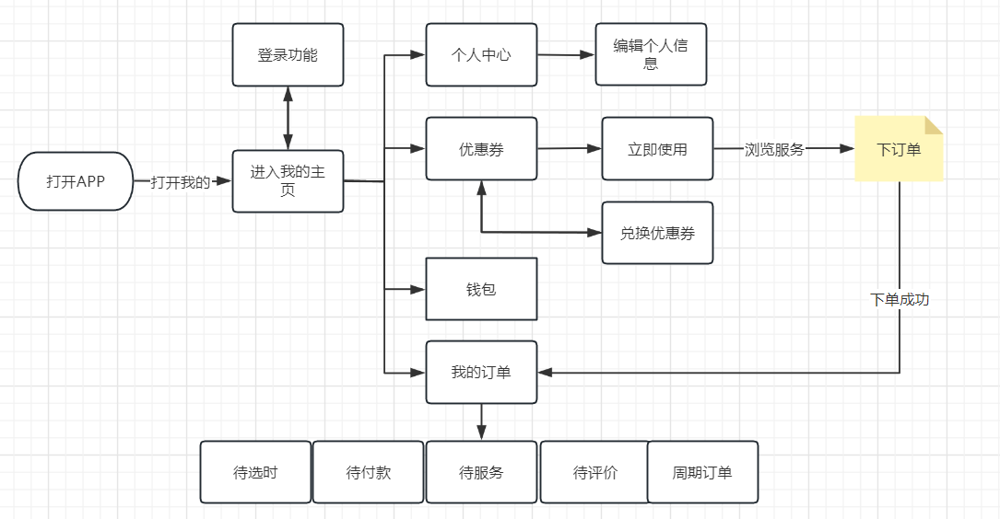
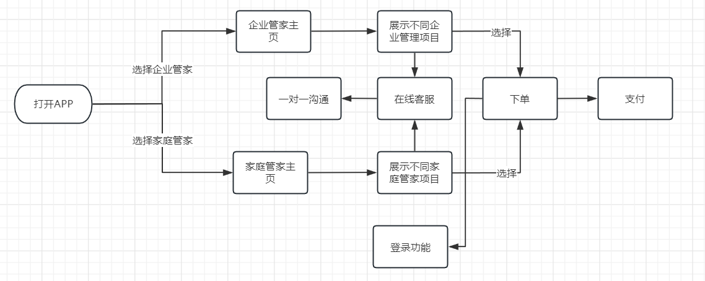
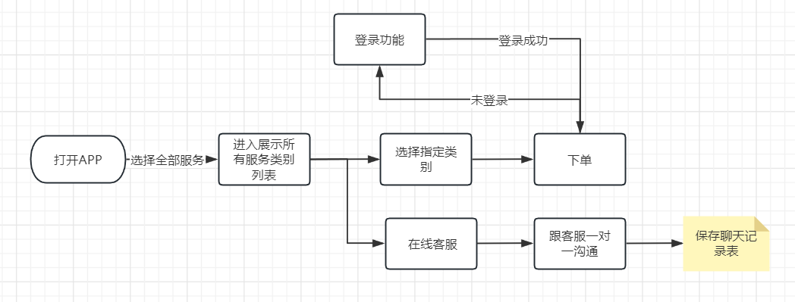

# 悦管家设计文档

### 项目背景描述

> 悦管家是一款家政服务的手机app，适用于上海地区的用户。作为一款便捷的家政工具，软件提供了各种家庭服务，包括保洁、保姆、月嫂、钟点工等。用户可以通过悦管家轻松预约所需的家政服务，方便快捷。软件致力于为上海用户提供优质的家政服务，以解决用户忙碌生活中的烦恼。通过这款软件，用户无需亲自寻找家政服务提供商，可以轻松享受到方便、可靠的家政服务

## 模块一:  普通用户模块(1-2人)

#### 业务描述

负责实现普通用户手机登录 看房管理,我的收藏，我的订阅,我的问答,我的足迹,卖房管理,租房管理,我的订单,我的优惠券 以及用户反馈和设置相关的功能

#### 界面展示

  

#### 前置条件

需要普通用户登录

#### 流程图

#### 表设计     

##### 用户表：user

| user_id  | user_phone | user_password | user_sex | birthday | create_time |
| :------: | :--------: | :-----------: | -------- | -------- | :---------: |
| 自增主键 |   手机号   |     密码      | 性别     | 生日     |  创建时间   |
|  bigint  |  varchar   |    varchar    | char     | datetime |  datetime   |

#### 优惠券表 coupon

| coupon_id | coupon_name | discount_amount | coupon_status              | create_time | expire_time | user_id |
| --------- | ----------- | --------------- | -------------------------- | ----------- | ----------- | ------- |
| 自增主键  | 优惠券名    | 优惠券金额      | 状态(未使用,已使用,已过期) | 创建时间    | 过期时间    | 用户id  |
| bigint    | varchar     | double          | char                       | datetime    | datetime    | bigint  |

#### 地址表  address

| address_id | name    | phone   | address-province | address_city | address_country | address_detail | user_id | update_time |
| ---------- | ------- | ------- | ---------------- | ------------ | --------------- | -------------- | ------- | ----------- |
| 自增主键   | 姓名    | 手机号  | 省               | 市           | 区              | 详细地址       | 用户id  | 更新时间    |
| bigint     | varchar | varchar | varchar          | varchar      | varchar         | varchar        | bigint  | datetime    |

#### 订单表: order

| order_id | order_no      | order_status                          | order_type          | order_amount | payment_amount | discount_amount | create_time | payment_time | user_id | project_id | score |
| -------- | ------------- | ------------------------------------- | ------------------- | ------------ | -------------- | --------------- | ----------- | ------------ | ------- | ---------- | ----- |
| 自增主键 | 订单编号,唯一 | 订单状态(待选时,待服务,待付款,待评价) | 订单类型(家庭,企业) | 订单金额     | 实付金额       | 优惠金额        | 创建时间    | 支付时间     | 用户id  | 项目id     | 好评  |
| bigint   | varchar       | char                                  | char                | double       | double         | double          | datetime    | datetime     | bigint  | bigint     | int   |

#### 钱包表 wallet

| wallet_id | user_id | wallet_balance | update_time |
| --------- | ------- | -------------- | ----------- |
| 自增主键  | 用户id  | 钱包余额       | 更新时间    |
| bigint    | bigint  | double         | datetime    |

#### 消费明细表 detail

| detail_id | wallet_id | detail_type                | detail_time | remark  |
| --------- | --------- | -------------------------- | ----------- | ------- |
| 自增主键  | 钱包id    | 出入账类型(充值,提现,收入) | 出入账时间  | 备注    |
| bigint    | bigint    | char                       | datetime    | varchar |

## 模块二 企业管家和家庭管家模块

#### 业务描述

负责实现推荐优质信息的推送，市场报告,AI楼盘分析,要闻，百科，楼市动态新闻,诸葛号等功能  根据文档关键词搜索 实现向下滑动分页等功能

#### 界面展示

 

 

 

 

 

#### 前置条件

无

#### 流程图

 

#### 表设计  

#### 用户表: user

| user_id  | user_phone | user_password | user_sex | birthday | create_time |
| :------: | :--------: | :-----------: | -------- | -------- | :---------: |
| 自增主键 |   手机号   |     密码      | 性别     | 生日     |  创建时间   |
|  bigint  |  varchar   |    varchar    | char     | datetime |  datetime   |

#### 优惠券表 coupon

| coupon_id | coupon_name | discount_amount | coupon_status              | create_time | expire_time | user_id |
| --------- | ----------- | --------------- | -------------------------- | ----------- | ----------- | ------- |
| 自增主键  | 优惠券名    | 优惠券金额      | 状态(未使用,已使用,已过期) | 创建时间    | 过期时间    | 用户id  |
| bigint    | varchar     | double          | char                       | datetime    | datetime    | bigint  |

#### 服务项目表:  project

| project_id | project_name | parent_id  | project_price | project_time | project_content | update_time |
| ---------- | ------------ | ---------- | ------------- | ------------ | --------------- | ----------- |
| 自增主键   | 项目名称     | 父级项目id | 项目价格      | 项目周期     | 项目描述        | 更新时间    |
| bigint     | varchar      | bigint     | double        | int          | varchar         | datetime    |

#### 服务项目类别表: project_category

| project_category_id | project_category_name | project_id | parent_id  | update_time |
| ------------------- | --------------------- | ---------- | ---------- | ----------- |
| 自增主键            | 类别名称              | 项目id     | 类别父级id | 更新时间    |
| bigint              | varchar               | bigint     | bigint     | datetime    |

####  订单表 order

| order_id | order_no      | order_status                          | order_type          | order_amount | payment_amount | discount_amount | create_time | payment_time | user_id | project_id | score |
| -------- | ------------- | ------------------------------------- | ------------------- | ------------ | -------------- | --------------- | ----------- | ------------ | ------- | ---------- | ----- |
| 自增主键 | 订单编号,唯一 | 订单状态(待选时,待服务,待付款,待评价) | 订单类型(家庭,企业) | 订单金额     | 实付金额       | 优惠金额        | 创建时间    | 支付时间     | 用户id  | 项目id     | 好评  |
| bigint   | varchar       | char                                  | char                | double       | double         | double          | datetime    | datetime     | bigint  | bigint     | int   |

#### 聊天记录表 chat

| chat_id  | chat_content | chat_type | create_time |
| -------- | ------------ | --------- | ----------- |
| 自增主键 | 聊天内容     | 消息类型  | 创建时间    |
| bigint   | varchar      | char      | datetime    |

#### 聊天索引表 chat_index

| chat_index_id | from_id  | to_id    | chat_id    |
| ------------- | -------- | -------- | ---------- |
| 自增主键      | 发送方id | 接收方id | 聊天内容id |
| bigint        | bigint   | bigint   | bigint     |

## 模块三: 服务模块

#### 业务描述

   主要实现首页展示房源基本信息,可以对城市进行切换, 实现新房  二手房， 租房 知识问答  地图找房 地铁房

贷款计算器 查房价 我要出租 找小区 等进行分类展示  以及首页推荐优质新房 二手房和租房内容

#### 界面展示

  

 

 

#### 前置条件

无

#### 流程图

#### 表设计  

#### 用户表: user

| user_id  | user_phone | user_password | user_sex | birthday | create_time |
| :------: | :--------: | :-----------: | -------- | -------- | :---------: |
| 自增主键 |   手机号   |     密码      | 性别     | 生日     |  创建时间   |
|  bigint  |  varchar   |    varchar    | char     | datetime |  datetime   |

#### 优惠券表 coupon

| coupon_id | coupon_name | discount_amount | coupon_status              | create_time | expire_time | user_id |
| --------- | ----------- | --------------- | -------------------------- | ----------- | ----------- | ------- |
| 自增主键  | 优惠券名    | 优惠券金额      | 状态(未使用,已使用,已过期) | 创建时间    | 过期时间    | 用户id  |
| bigint    | varchar     | double          | char                       | datetime    | datetime    | bigint  |

#### 服务项目表:  project

| project_id | project_name | parent_id  | project_price | project_time | project_content | update_time |
| ---------- | ------------ | ---------- | ------------- | ------------ | --------------- | ----------- |
| 自增主键   | 项目名称     | 父级项目id | 项目价格      | 项目周期     | 项目描述        | 更新时间    |
| bigint     | varchar      | bigint     | double        | int          | varchar         | datetime    |

#### 服务项目类别表:  project_category

| project_category_id | project_category_name | project_id | parent_id  | update_time |
| ------------------- | --------------------- | ---------- | ---------- | ----------- |
| 自增主键            | 类别名称              | 项目id     | 类别父级id | 更新时间    |
| bigint              | varchar               | bigint     | bigint     | datetime    |

####  订单表 order

| order_id | order_no      | order_status                          | order_type          | order_amount | payment_amount | discount_amount | create_time | payment_time | user_id | project_id | score |
| -------- | ------------- | ------------------------------------- | ------------------- | ------------ | -------------- | --------------- | ----------- | ------------ | ------- | ---------- | ----- |
| 自增主键 | 订单编号,唯一 | 订单状态(待选时,待服务,待付款,待评价) | 订单类型(家庭,企业) | 订单金额     | 实付金额       | 优惠金额        | 创建时间    | 支付时间     | 用户id  | 项目id     | 好评  |
| bigint   | varchar       | char                                  | char                | double       | double         | double          | datetime    | datetime     | bigint  | bigint     | int   |

#### 聊天记录表  chat

| chat_id  | chat_content | chat_type | create_time |
| -------- | ------------ | --------- | ----------- |
| 自增主键 | 聊天内容     | 消息类型  | 创建时间    |
| bigint   | varchar      | char      | datetime    |

#### 聊天索引表 chat_index

| chat_index_id | from_id  | to_id    | chat_id    |
| ------------- | -------- | -------- | ---------- |
| 自增主键      | 发送方id | 接收方id | 聊天内容id |
| bigint        | bigint   | bigint   | bigint     |

## 模块四 : 管理员模块(1-2人)

#### 业务描述

 主要用户对于管理员端口登录进来的数据展示以及后台不同模块的数据进行管理(比如订单列表,家庭和企业方案 聊天记录等...)

#### 前置条件

需要管理员登录

#### 流程图

拥有全部普通用户的功能 +后台管理的功能(不同模块增删改查)

#### 表设计

#### 用户表: user

| user_id  | user_phone | user_password | user_sex | birthday | create_time |
| :------: | :--------: | :-----------: | -------- | -------- | :---------: |
| 自增主键 |   手机号   |     密码      | 性别     | 生日     |  创建时间   |
|  bigint  |  varchar   |    varchar    | char     | datetime |  datetime   |

#### 地址表: address

| address_id | name    | phone   | address-province | address_city | address_country | address_detail | user_id | update_time |
| ---------- | ------- | ------- | ---------------- | ------------ | --------------- | -------------- | ------- | ----------- |
| 自增主键   | 姓名    | 手机号  | 省               | 市           | 区              | 详细地址       | 用户id  | 更新时间    |
| bigint     | varchar | varchar | varchar          | varchar      | varchar         | varchar        | bigint  | datetime    |

#### 优惠券表: coupon

| coupon_id | coupon_name | discount_amount | coupon_status              | create_time | expire_time | user_id |
| --------- | ----------- | --------------- | -------------------------- | ----------- | ----------- | ------- |
| 自增主键  | 优惠券名    | 优惠券金额      | 状态(未使用,已使用,已过期) | 创建时间    | 过期时间    | 用户id  |
| bigint    | varchar     | double          | char                       | datetime    | datetime    | bigint  |

#### 服务项目表:   project

| project_id | project_name | parent_id  | project_price | project_time | project_content | update_time |
| ---------- | ------------ | ---------- | ------------- | ------------ | --------------- | ----------- |
| 自增主键   | 项目名称     | 父级项目id | 项目价格      | 项目周期     | 项目描述        | 更新时间    |
| bigint     | varchar      | bigint     | double        | int          | varchar         | datetime    |

#### 服务项目类别表: 

| project_category_id | project_category_name | project_id | parent_id  | update_time |
| ------------------- | --------------------- | ---------- | ---------- | ----------- |
| 自增主键            | 类别名称              | 项目id     | 类别父级id | 更新时间    |
| bigint              | varchar               | bigint     | bigint     | datetime    |

#### 订单表: order

| order_id | order_no      | order_status                          | order_type          | order_amount | payment_amount | discount_amount | create_time | payment_time | user_id | project_id | score |
| -------- | ------------- | ------------------------------------- | ------------------- | ------------ | -------------- | --------------- | ----------- | ------------ | ------- | ---------- | ----- |
| 自增主键 | 订单编号,唯一 | 订单状态(待选时,待服务,待付款,待评价) | 订单类型(家庭,企业) | 订单金额     | 实付金额       | 优惠金额        | 创建时间    | 支付时间     | 用户id  | 项目id     | 好评  |
| bigint   | varchar       | char                                  | char                | double       | double         | double          | datetime    | datetime     | bigint  | bigint     | int   |

#### 聊天记录表: chat

| chat_id  | chat_content | chat_type | create_time |
| -------- | ------------ | --------- | ----------- |
| 自增主键 | 聊天内容     | 消息类型  | 创建时间    |
| bigint   | varchar      | char      | datetime    |

#### 聊天索引表: chat_index

| chat_index_id | from_id  | to_id    | chat_id    |
| ------------- | -------- | -------- | ---------- |
| 自增主键      | 发送方id | 接收方id | 聊天内容id |
| bigint        | bigint   | bigint   | bigint     |

#### 钱包表: wallet

| wallet_id | user_id | wallet_balance | update_time |
| --------- | ------- | -------------- | ----------- |
| 自增主键  | 用户id  | 钱包余额       | 更新时间    |
| bigint    | bigint  | double         | datetime    |

#### 钱包明细表: detail

| detail_id | wallet_id | detail_type                | detail_time | remark  |
| --------- | --------- | -------------------------- | ----------- | ------- |
| 自增主键  | 钱包id    | 出入账类型(充值,提现,收入) | 出入账时间  | 备注    |
| bigint    | bigint    | char                       | datetime    | varchar |

#### 角色表: role

| role_id  | role_name | role_code      | create_time | update_time | remark  |
| -------- | --------- | -------------- | ----------- | ----------- | ------- |
| 自增主键 | 角色名称  | 角色权限字符串 | 创建时间    | 更新时间    | 备注    |
| bigint   | varchar   | varchar        | datetime    | datetime    | varchar |

#### 权限表: menu

| menu_id  | menu_name | icon     | parent_id | order_num | path     | component | menu_type                     | create_time | update_time | remark  |
| -------- | --------- | -------- | --------- | --------- | -------- | --------- | ----------------------------- | ----------- | ----------- | ------- |
| 自增主键 | 菜单名称  | 菜单图标 | 父菜单id  | 排序      | 路由地址 | 组件路径  | 菜单类型（m目录 c菜单 f按钮） | 创建时间    | 更新时间    | 备注    |
| bigint   | varchar   | varchar  | bigint    | bigint    | varchar  | varchar   | char                          | datetime    | datetime    | varchar |

#### 用户和角色关系表: user_role

| id       | user_id | role_id |
| -------- | ------- | ------- |
| 自增主键 | 用户id  | 角色id  |
| bigint   | bigint  | bigint  |

#### 角色和权限关系表: role_menu

| id       | role_id | menu_id |
| -------- | ------- | ------- |
| 自增主键 | 角色id  | 权限id  |
| bigint   | bigint  | bigint  |

## 模块五: 权限模块

#### 业务描述

 主要用户控制各个模块之间的权限分配,主要是用于什么角色的账户可以操作什么功能

#### 前置条件

需要管理员登录

#### 流程图

无

#### 表设计

#### 用户表 user

| user_id  | user_phone | user_password | create_time |
| :------: | :--------: | :-----------: | :---------: |
| 自增主键 |   手机号   |     密码      |  创建时间   |
|  bigint  |  varchar   |    varchar    |  datetime   |

#### 角色表 role

| role_id  | role_name | role_code      | create_time | update_time | remark  |
| -------- | --------- | -------------- | ----------- | ----------- | ------- |
| 自增主键 | 角色名称  | 角色权限字符串 | 创建时间    | 更新时间    | 备注    |
| bigint   | varchar   | varchar        | datetime    | datetime    | varchar |

#### 用户角色关系表  user_role

| id       | user_id | role_id |
| -------- | ------- | ------- |
| 自增主键 | 用户id  | 角色id  |
| bigint   | bigint  | bigint  |

>注: 用户和角色实现多对多关联 通过它表示该用户是管理员

####  权限菜单表 menu

| menu_id  | menu_name | icon     | parent_id | order_num | path     | component | menu_type                     | create_time | update_time | remark  |
| -------- | --------- | -------- | --------- | --------- | -------- | --------- | ----------------------------- | ----------- | ----------- | ------- |
| 自增主键 | 菜单名称  | 菜单图标 | 父菜单id  | 排序      | 路由地址 | 组件路径  | 菜单类型（m目录 c菜单 f按钮） | 创建时间    | 更新时间    | 备注    |
| bigint   | varchar   | varchar  | bigint    | bigint    | varchar  | varchar   | char                          | datetime    | datetime    | varchar |

#### 权限角色关系表  role_menu

| id       | role_id | menu_id |
| -------- | ------- | ------- |
| 自增主键 | 角色id  | 权限id  |
| bigint   | bigint  | bigint  |

>注: 角色和权限实现多对多关联